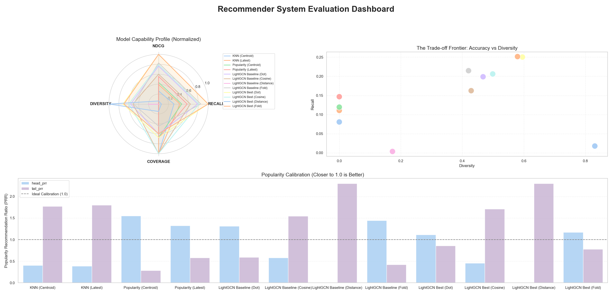
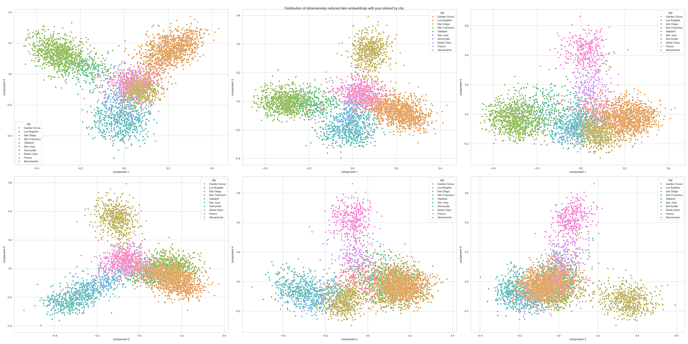

# Google Maps Recommender System

## 1. Overview

We developed a recommender system using the Google Maps review dataset to recommend places (POIs) that users are likely to enjoy. We employed **LightGCN (Light Graph Convolutional Network)** [[1]](#ref1), a state-of-the-art graph neural network (GNN) model.
This project allows you to create your own subset of review data by specifying a list of categories to extract, enabling the construction of a customized recommender system tailored to specific domains.

## 2. Dataset

### 2.1. Raw Dataset
We used [Google Local Data (2021)](https://mcauleylab.ucsd.edu/public_datasets/gdrive/googlelocal/) [[2](#ref2), [3](#ref3)], which contains approximately 660 million reviews, 110 million users, and 4 million businesses in the United States (up to September 2021).

The dataset consists of two types of tables: `review` and `meta`. Below are the descriptions of the columns specifically used in our model:

* **`review`** (User-Business Interactions):
    * `user_id`: Unique user ID.
    * `gmap_id`: Unique business ID.
    * `name`: User name (used only for inference).
    * `time`: Unix timestamp (in milliseconds) of the review.
    * `rating`: Discrete rating from 1 to 5.

* **`meta`** (Business Information):
    * `gmap_id`: Unique business ID.
    * `name`: Business name (used only for inference).
    * `address`: Business address.
    * `latitude` / `longitude`: Geolocation of the business.
    * `category`: Business categories (used for filtering).
    * `avg_rating`: Average rating (used for analysis).
    * `num_of_reviews`: Total number of reviews.
    * `price`: Price range scale (e.g., "\$", "\$\$").

### 2.2. Filtering
We first filtered businesses and reviews based on specified categories using the `category` column in the metadata. To extract only positive interactions, we first filtered reviews with a rating of 4 or 5. Then, to address the data sparsity problem, we conducted **$k$-core filtering** with $k=5$. This ensures that all users and businesses in the dataset have at least $k$ associated reviews.

In our experiments, we constructed three distinct datasets to evaluate our model:

| Dataset | Categories | States | Users | Businesses | Reviews |
| :--- | :--- | :--- | :--- | :--- | :--- |
| **Japanese** | Japanese, Ramen, Sushi | All | 136,490 | 21,725 | 972,295 |
| **Cafe** | Cafe, Coffee | CA (California) | 139,856 | 13,472 | 1,215,589 |
| **Asian** | Chinese, Japanese, Thai, Vietnamese, Korean, Indian, Filipino | All | 549,269 | 72,226 | 4,638,057 |

### 2.3. Train/Validation/Test Splits (Temporal Split)

We split the dataset into three sets using a **leave-one-out strategy** based on timestamps.
For each user, we sorted their reviews chronologically and assigned them as follows:

* **Test:** The most recent review.
* **Validation:** The second most recent review.
* **Train:** All remaining historical reviews.

Since we applied 5-core filtering, every user has at least 5 reviews. This guarantees that the training set contains at least 3 reviews per user, while the validation and test sets contain exactly one review per user.
## 3. Model Architecture

### 3.1. Graph Construction
To implement LightGCN, we first construct an adjacency matrix representing the graph structure. We model the interactions as a graph where nodes consist of both users and businesses. The adjacency matrix is a sparse matrix of size $(N_{user} + N_{item}) \times (N_{user} + N_{item})$.

We experimented with three different strategies for defining edges and their initial weights ($w_{ui}$):

* **Naive (Binary Weights):**
    * A standard user-item bipartite graph.
    * Edges exist only between a user and a business if a review exists.
    * **Weight:** All edges are assigned a weight of $1$.

* **Time Decay:**
    * The graph structure is identical to the `Naive` graph, but edge weights are continuous values based on the "freshness" of the review.
    * **Weight:** We apply an exponential decay function based on the time elapsed since the latest review in the dataset ($t_{\max}$):
        $$
        w_{ui} = (1 - w_{\min}) e^{-\lambda(t_{\max} - t_{ui})} + w_{\min}
        $$
        where $w_{\min}$ is the minimum weight, $\lambda$ is the decay coefficient, and $(t_{\max} - t_{ui})$ represents the age of the review.

* **Geo-Distance (Item-Item Edges):**
    * In addition to user-item interactions, we augment the graph with **item-item edges** connecting businesses that are geographically close.
    * **Structure:** We used two strategies to define neighbors:
        * *k-Nearest Neighbors:* Connect the $k$ closest businesses.
        * *Distance Threshold:* Connect all businesses within $d$ km.
    * **Weight:** We applied two weighting strategies for these auxiliary edges:
        * *Constant:* Fixed weight (hyperparameter).
        * *Dynamic:* Gaussian kernel based on distance:
            $$
            w_{ii'} = e^{-dist(i, i')^2 / \sigma^2}
            $$
            where $dist(i, i')$ is the distance in km and $\sigma$ controls the decay speed.

### 3.2. Graph Normalization
After defining the initial weights $w_{ui}$ (or $w_{ii'}$), we apply **Symmetric Laplacian Normalization** to ensure training stability and prevent scale explosion. The normalized entry $\tilde{a}_{ui}$ in the adjacency matrix is calculated as:

$$
\tilde{a}_{ui} = \frac{w_{ui}}{\sqrt{D_u D_i}}
$$

where $D_u$ and $D_i$ denote the weighted degree of user $u$ and item $i$, respectively (i.e., $D_u = \sum_{i} w_{ui}$).

### 3.3. LightGCN Propagation
We employ LightGCN to learn low-dimensional representations (embeddings) for users and items. Unlike standard GCNs, LightGCN removes feature transformation and non-linear activation, relying solely on neighbor aggregation.

**Graph Convolution (Layer Propagation):**
At each layer $k$, the embedding of a node is updated by aggregating the embeddings of its neighbors using the normalized weights defined above:

$$
\mathbf{e}_u^{(k+1)} = \sum_{i \in \mathcal{N}_u} \tilde{a}_{ui} \mathbf{e}_i^{(k)}, \quad
\mathbf{e}_i^{(k+1)} = \sum_{u \in \mathcal{N}_i} \tilde{a}_{ui} \mathbf{e}_u^{(k)}
$$

where $\mathbf{e}_u^{(0)}$ and $\mathbf{e}_i^{(0)}$ are the initialized embeddings (ID embeddings).

**Layer Combination (Readout):**
The final representation for each user and item is obtained by averaging the embeddings from all layers $K$:

$$
\mathbf{e}_u^* = \frac{1}{K+1} \sum_{k=0}^K \mathbf{e}_u^{(k)}, \quad
\mathbf{e}_i^* = \frac{1}{K+1} \sum_{k=0}^K \mathbf{e}_i^{(k)}
$$

These final embeddings $\mathbf{e}_u^*$ and $\mathbf{e}_i^*$ are used to compute the prediction score via the inner product.

### 3.4 Layer Weighting
In our naive model, we take the average of embeddings from different layers. However, as the number of layers increases, the embeddings may become over-smoothed and lose specific information about the original user or business. Therefore, we applied the decaying weighting for layer embedding as follows:

$$
\mathbf{e}_u^* = \sum_{k=0}^K w_k\mathbf{e}_u^{(k)}, \quad
\mathbf{e}_i^* = \sum_{k=0}^K w_k\mathbf{e}_i^{(k)}, \quad
w_k = \frac{1.0 - kd}{\sum_{k=0}^K (1.0 - kd)}
$$

## 4. Optimization & Regularization

### 4.1. Optimization (BPR Loss)
To optimize the model parameters, we employed **Bayesian Personalized Ranking (BPR) loss**. This pairwise loss function encourages the model to assign higher scores to observed user-item interactions (positive pairs) compared to unobserved ones (negative pairs).

The BPR loss is formulated as:

$$
\mathcal{L}_\text{BPR} = -\frac{1}{|\mathcal{D}|}\sum_{(u, i, j) \in \mathcal{D}} \ln \sigma(\hat{y}_{ui} - \hat{y}_{uj})
$$

where:
* $\mathcal{D}$ is the training dataset consisting of triples $(u, i, j)$.
* $i$ denotes a positive item (observed interaction).
* $j$ denotes a negative item (unobserved interaction).
* $\hat{y}_{ui} = {\mathbf{e}^*_u} \cdot \mathbf{e}^*_i$ is the predicted score.
* $\sigma(\cdot)$ is the sigmoid function.

Minimizing this loss maximizes the margin between the scores of positive and negative items, guiding the embeddings of similar users and items to align closer in the vector space.

### 4.2. Regularizations

To prevent overfitting and improve model robustness, we apply two types of regularization.

**1. $L_2$ Regularization**
We apply standard $L_2$ regularization to the embeddings at each batch to prevent them from growing exponentially large:

$$
\mathcal{L}_{L2} = \sum_{(u, i, j) \in \mathcal{D}} \left( \|\mathbf{e}_u^{(0)}\|_2^2 + \|\mathbf{e}_i^{(0)}\|_2^2 + \|\mathbf{e}_j^{(0)}\|_2^2 \right)
$$

**2. Contrastive Learning (SimGCL)**
To enhance the robustness of learned representations against noise, we integrated **SimGCL** [[4](#ref4)]. This method generates two "views" of the node embeddings by adding random noise perturbation and maximizes the consistency between these views using contrastive loss (InfoNCE loss).

The contrastive loss is formulated as:

$$
\mathcal{L}_\text{CL} = \sum_{u \in \mathcal{B}} -\log \frac{\exp(\text{sim}(\mathbf{e}'_u, \mathbf{e}''_u) / \tau)}{\sum_{v \in \mathcal{B}} \exp(\text{sim}(\mathbf{e}'_u, \mathbf{e}''_v) / \tau)}
$$

where:
* $\mathbf{e}'_u = \mathbf{e}^*_u + \epsilon \cdot z_1$ and $\mathbf{e}''_u = \mathbf{e}^*_u + \epsilon \cdot z_2$ are the perturbed embeddings ($z \sim \mathcal{N}(0, 1)$).
* $\text{sim}(\cdot)$ denotes the cosine similarity.
* $\tau$ is the temperature hyperparameter.
* $\epsilon$ controls the magnitude of the noise.

**Total Loss**
The final objective function combines BPR loss, $L_2$ regularization, and the contrastive loss:

$$
\mathcal{L} = \mathcal{L}_\text{BPR} + \lambda_{L2}\mathcal{L}_{L2} + \lambda_\text{CL} \mathcal{L}_\text{CL}
$$

where $\lambda_{L2}, \lambda_\text{CL}$ are the weights for the $L_2$ regularization and the contrastive loss term, respectively.

### 4.3. Negative Sampling Strategy (MixGCF)
In a standard training setup, negative samples are uniformly drawn from all businesses a user has not interacted with. However, in location-based recommendations, this often leads to "easy negatives" (e.g., businesses that are geographically too distant for the user to visit), which provide little gradient information during training.

To address this, we employed **MixGCF** [[5](#ref5)], a strategy designed to synthesize hard negatives. Instead of directly using a sampled negative item, MixGCF constructs a synthetic hard negative by interpolating the embeddings of a positive item and a sampled negative item.

The process is as follows:
1. Sample a batch of candidate negative items $\mathcal{M}$ from the unobserved set.
2. Select a candidate negative item $j \in \mathcal{M}$ (typically the one with the highest score or based on specific selection criteria).
3. Synthesize the hard negative embedding $\mathbf{e}'_j$ by mixing information from the positive item $i$:

$$
\mathbf{e}'_j = \alpha \mathbf{e}^{*}_{i} + (1 - \alpha) \mathbf{e}^{*}_{j}
$$

where:
* $\mathbf{e}^*_i$ is the embedding of the positive item.
* $\mathbf{e}^*_j$ is the embedding of the selected negative item.
* $\alpha$ is a hyperparameter controlling the mixing ratio.

This synthesized embedding $\mathbf{e}'_j$ serves as a harder negative sample for computing the BPR loss, forcing the model to better discriminate between true positive items and difficult false candidates.

## 5. Experiments & Validations

### 5.1. Evaluation Metrics
To evaluate the recommendation performance, we adopted two widely used metrics for top-$K$ recommendation: **Recall@K** and **NDCG@K**. In our experiments, we set $K=20$.

* **Recall@20:**
    Measures the proportion of relevant items (i.e., the item in the test set) that are successfully included in the top-20 recommendation list. It indicates the model's ability to retrieve correct items.
    
* **NDCG@20 (Normalized Discounted Cumulative Gain):**
    Evaluates the quality of the ranking order. Unlike Recall, NDCG accounts for the position of the relevant item in the list, assigning higher scores when the correct item is ranked higher.

### 5.2. Hyperparameter Search
To determine the optimal configuration for our model, we conducted an extensive hyperparameter search. We trained various models with different configurations to identify the techniques that work best for our specific dataset.
For all experiments, we employed **early stopping** with a patience of 20 epochs based on the validation NDCG@20 score. The model checkpoint with the highest validation NDCG was selected as the final model for each configuration.

The search space was as follows:

* **Training Strategy**
    * **Common:**
        * `batch_size` $[1024, 2048, 4096]$: Number of samples per batch.
        * `lr` $[0.01, 0.001, 0.0001]$: Learning rate.
        * `reg_weight` $[1\text{e-}2, 1\text{e-}3, 1\text{e-}4, 1\text{e-}5]$: Weight for $L_2$ regularization.
    * **SimGCL (Contrastive Learning):**
        * `gcl_reg` $[0.05, 0.1, 0.2, 0.5]$: Weight for the contrastive loss term ($\lambda_\text{CL}$).
        * `gcl_eps` $[0.05, 0.1, 0.2]$: Magnitude of the added noise ($\epsilon$).
        * `gcl_temp` $[0.1, 0.2, 0.3, 0.4, 0.5]$: Temperature parameter for InfoNCE loss ($\tau$).
    * **MixGCF (Hard Negative Sampling):**
        * `mix_alpha` $[0.2, 0.4, 0.6]$: Interpolation coefficient ($\alpha$).
        * `mix_n_candidates` $[32, 64]$: Size of the negative candidate pool ($\mathcal{M}$).

* **Model Architecture**
    * **Common:**
        * `embedding_dim` $[32, 64, \dots, 1024]$: Dimension of user/item embeddings.
        * `n_layers` $[2, 3, \dots, 8]$: Number of GCN propagation layers.
    * **Layer Weighting:**
        * `layer_weighting` $[\text{uniform}, \text{gentle}]$: Strategy for aggregating layer embeddings.
        * `layer_decay` $[0.05, 0.1]$: Decay rate if using the decay-based weighting strategy.
    * **Time Decay:**
        * `time_decay` $[1\text{e-}4, 5\text{e-}4, 1\text{e-}3]$: Decay coefficient ($\lambda$).
        * `time_min_weight` $[0.1, 0.3]$: Minimum edge weight ($w_\text{min}$).
    * **Geo Distance (Item-Item Edges):**
        * `geo_threshold` $[5.0, 10.0, 20.0]$: Distance threshold (km) for connecting items.
        * `geo_sigma` $[7.0, 8.0, 9.0]$: Kernel width ($\sigma$) for distance-based weighting.
        * `geo_k_neighbors` $[5, 10, 15, 20]$: Number of nearest neighbors ($k$-NN).
        * `geo_weight` $[0.1, 1.0]$: Constant weight for item-item edges.

### 5.3. Baseline and Best Configuration

After a series of experiments, we identified the following configuration as the baseline and best performing model:

*** Baseline ***
``` yaml
training:
  batch_size: 1024
  lr: 0.001
  reg_weight: 0.0001

model:
  embedding_dim: 64
  n_layers: 3
```

*** Best ***
```yaml
training:
  batch_size: 1024
  lr: 0.001
  reg_weight: 0.001

  gcl_reg: 0.1
  gcl_eps: 0.1
  gcl_temp: 0.2

  mix_alpha: 0.6
  mix_n_candidates: 32

model:
  embedding_dim: 512
  n_layers: 4

  geo_k_neighbors: 4
  geo_weight: 1.0
```

## 6. Evaluation Metrics on Test Dataset

To comprehensively evaluate the performance of our recommender system, we employ a diverse set of metrics covering **Accuracy**, **Diversity**, **Catalog Coverage**, and **Popularity Bias**.

### 6.1. Accuracy Metrics
These metrics measure the model's ability to predict the specific POIs that users actually visited in the test set.

* **Recall@K**
    * Measures the proportion of relevant items (ground-truth visits) that are successfully retrieved in the top-$K$ recommendation list.
    * Higher values indicate a better ability to find correct items.

* **NDCG@K (Normalized Discounted Cumulative Gain)**
    * A ranking-aware metric that evaluates the quality of the ranking order.
    * Unlike Recall, NDCG assigns higher scores when relevant items are placed at the top of the list.

### 6.2. Diversity & Novelty
Beyond accuracy, we evaluate the quality of recommendations to ensure users are exposed to diverse and interesting items.

* **Novelty@K**
    * Measures how "unexpected" or unpopular the recommended items are.
    * It is calculated as the average self-information of the recommended items:
      $$
      \text{Novelty}@K = \frac{1}{K} \sum_{i \in \hat{\mathcal{I}}_u} -\log_2 p(i)
      $$
      where $p(i)$ is the popularity probability of item $i$ in the training set. A higher value implies the model suggests niche or less known spots.

* **Diversity@K (Intra-List Diversity)**
    * Measures the semantic dissimilarity among items within a single recommendation list.
    * It is computed based on the pairwise cosine distance of item embeddings:
      $$
      \text{Diversity}@K = \frac{2}{K(K-1)} \sum_{i, j \in \hat{\mathcal{I}}_u, i < j} (1 - \text{sim}(\mathbf{e}_i, \mathbf{e}_j))
      $$
      High diversity indicates the model recommends a variety of item types (e.g., mixing Parks, Cafes, and Museums) rather than a homogeneous list.

### 6.3. Catalog Coverage & Distribution
These metrics assess how the model utilizes the item catalog and distributes recommendations.

* **Coverage**
    * The ratio of unique items recommended to at least one user across the entire test set relative to the total number of items in the catalog.
    * High coverage ensures the model explores the catalog fully and does not ignore valid businesses.

* **Gini Index**
    * Measures the inequality of the recommendation frequency distribution across items.
    * **Value $\approx 0$:** Recommendations are evenly distributed among all items.
    * **Value $\approx 1$:** Recommendations are highly concentrated on a few items (Rich-get-richer effect).

### 6.4. Popularity Bias Analysis
We analyze whether the model over-recommends popular items ("Head") at the expense of less popular ones ("Tail").

* **Popularity Correlation (Spearman)**
    * The Spearman rank correlation between an item's popularity in the training set and its recommendation frequency.
    * A high positive correlation indicates strong popularity bias (the model simply mimics historical popularity).

* **KL Divergence**
    * Measures the divergence between the distribution of item popularity in the training set and the distribution of recommendations.
    * Lower values indicate the model preserves the original popularity distribution of the data.

* **Head-PRR / Tail-PRR (Popularity Reproduction Ratio)**
    * Measures the deviation of recommendation volume for "Head" (top 20% popular) and "Tail" (bottom 80% popular) items.
      $$
      \text{PRR} = \frac{\text{Share of Recommendations}}{\text{Share of Training Interactions}}
      $$
    * **PRR $> 1.0$:** The group is over-recommended (amplified bias).
    * **PRR $< 1.0$:** The group is under-recommended.
    * Ideally, PRR should be close to 1.0 to ensure fair exposure for tail items.

## 7. Analysis

### 7.1. Baselines (Heuristic Methods)
To validate that our model learns meaningful representations beyond simple geographical proximity or popularity bias, we compared it against four heuristic baselines based on **Distance** and **Popularity**.

**Metrics**
We use the Haversine distance $d(u, i)$ between the user's reference point and the business location.
* **KNN (Distance Only):** Ranks businesses solely by proximity.
    $$\text{Score} = - d(u, i)$$
* **Popularity (Distance-Weighted):** Ranks businesses by popularity, penalized by distance.
    $$\text{Score} = \frac{\text{Popularity}_i}{d(u, i) + \epsilon}$$

**Reference Points**
For each metric, we tested two strategies to define the user's location:
* **Centroid:** The geometric center (mean latitude/longitude) of all businesses the user has visited.
* **Latest:** The location of the most recent business the user visited.

### 7.2. Embedding Evaluation Strategies
For the trained LightGCN model, we evaluated four different strategies to compute the relevance score between a user $u$ and an item $i$.

* **`dot`**: Standard dot product.
    $$s = \mathbf{e}_u \cdot \mathbf{e}_i$$
* **`cosine`**: Cosine similarity.
    $$s = \frac{\mathbf{e}_u \cdot \mathbf{e}_i}{\|\mathbf{e}_u\| \|\mathbf{e}_i\|}$$
* **`distance`**: Negative Euclidean ($L_2$) distance (closer is better).
    $$s = - \|\mathbf{e}_u - \mathbf{e}_i\|_2$$
* **`fold` (Folding-in / GCN Aggregation)**:
    Instead of using the learned user embedding parameter directly, we dynamically construct the user embedding from their interaction history using the GCN propagation rule. This allows us to assess the quality of the graph structure itself.
    $$\mathbf{e}_u = \sum_{j \in \mathcal{H}_u} \frac{1}{\sqrt{|\mathcal{H}_u| |\mathcal{N}_j|}} \mathbf{e}_j$$
    where $\mathcal{H}_u$ is the user's history in the training set.

The table below is the summarization of results on `Cafe` test dataset:

| name                         | type     | model      | recall                | ndcg                  | novelty            | diversity            | coverage            | gini                | pop_correlation     | kl_divergence      | head_prr               | tail_prr            |
|------------------------------|----------|------------|-----------------------|-----------------------|--------------------|----------------------|---------------------|---------------------|---------------------|--------------------|------------------------|---------------------|
| KNN (Centroid)               | centroid | knn        | 0.08070443885139      | 0.029965223108823023  | 14.419039667095072 | 0.0                  | 0.9998515439429929  | 0.39587843415663915 | 0.09091628611771052 | 0.7531611742526634 | 0.40649700718722825    | 1.772443624089647   |
| KNN (Latest)                 | latest   | knn        | 0.1108282805171033    | 0.04355408529254955   | 14.467154415936301 | 0.0                  | 0.9996288598574822  | 0.29169240893237386 | 0.07134084986109962 | 0.6339756057918315 | 0.3856880797898012     | 1.7995264248285432  |
| Popularity (Centroid)        | centroid | popularity | 0.11950148724402242   | 0.04832591542185483   | 11.57775077206134  | 0.0                  | 0.7690766033254157  | 0.8630563202215322  | 0.940913985878973   | 1.4520567751664126 | 1.548638119373491      | 0.28594796930320066 |
| Popularity (Latest)          | latest   | popularity | 0.14672949319299852   | 0.061056935968263074  | 12.121524536529162 | 0.0                  | 0.7789489311163895  | 0.769174565524013   | 0.8679576644490701  | 1.3176151400421308 | 1.321146567354954      | 0.5820280245328658  |
| LightGCN Baseline (Dot)      | dot      | baseline   | 0.1988545360942684    | 0.08314586998843561   | 12.4183335855642   | 0.46751039140817163  | 0.7181561757719715  | 0.7441993335344621  | 0.9582693276804775  | 1.2281133589318654 | 1.3138743482496038     | 0.5914928113139541  |
| LightGCN Baseline (Cosine)   | cosine   | baseline   | 0.1624671090264272    | 0.0657383988587392    | 13.881335798886568 | 0.42881123117609027  | 1.0                 | 0.3555411638321371  | 0.7098025369817464  | 0.3182159054950106 | 0.5804973194663242     | 1.5459823704191116  |
| LightGCN Baseline (Distance) | distance | baseline   | 0.0036251573046562177 | 0.0018379189980157681 | 2.212691702468223  | 0.1729499873955699   | 0.2958729216152019  | 0.9905502319904002  | -0.7294331759286627 | 27.663992870522605 | 1.7031520707479387e-13 | 2.301499122066252   |
| LightGCN Baseline (Fold)     | fold     | baseline   | 0.21469225489074475   | 0.08989441411579911   | 12.23348606218732  | 0.42025027271266824  | 0.6097832541567696  | 0.806226859681733   | 0.9326051049258013  | 2.3827897589711813 | 1.4448014768300366     | 0.42109126841183664 |
| LightGCN Best (Dot)          | dot      | best       | 0.25149439423406933   | 0.10918329371286661   | 12.748088433287384 | 0.6963094535210547   | 0.8373663895486936  | 0.6684359483425062  | 0.899782029450418   | 0.8059163385664677 | 1.121121029335543      | 0.8423610866560036  |
| LightGCN Best (Cosine)       | cosine   | best       | 0.21830311177210845   | 0.09075475605767204   | 14.10885110727956  | 0.6496916935572348   | 0.9930225653206651  | 0.34004320523879195 | 0.5075813849532154  | 0.4680108823355562 | 0.5305881360122796     | 1.6109391288676052  |
| LightGCN Best (Distance)     | distance | best       | 0.003753861114288983  | 0.002245046955911707  | 0.2493391745751124 | 0.057068560301009666 | 0.23960807600950118 | 0.995697216097365   | -0.6680823936109712 | 28.05134595183703  | 1.7031520707479387e-13 | 2.301499122066252   |
| LightGCN Best (Fold)         | fold     | best       | 0.2536895092094726    | 0.10962693974808782   | 12.64764133396928  | 0.68095142952352     | 0.7907511876484561  | 0.702836252990351   | 0.8907573950063261  | 1.1427515180579535 | 1.1849456100535938     | 0.7592934508851997  |



*You can see more details in `./results/[category]/test_performances.csv` or `./results/[category]/test_performances.png`*

Here is a sample of recommended businesses for a user in the dataset with `best` model trained with `Cafe` dataset whose scores are calculated with the `fold` method:

```
================================================================================
Recommendations for user Sean O'Hara with LightGCN Best (Fold)
  History
    [ 2782] [California     ] The Buena Vista
    [ 7672] [California     ] Superba Snacks + Coffee
    [ 7613] [California     ] Cafe de Leche
    [ 7936] [California     ] Brooklyn Bagel Bakery
    [ 7947] [California     ] Stories
    [ 3149] [California     ] Basque Boulangerie Café
    [ 7678] [California     ] Urth Caffe Pasadena
    [ 6464] [California     ] Playa Provisions
    [ 4944] [California     ] The Red Hut Café
    [ 2059] [California     ] Parker-Lusseau Pastries
    [ 3151] [California     ] Sideboard Danville
    [ 8116] [California     ] The Original Pantry Cafe
    [ 6733] [California     ] Cassell's Hamburgers
    [ 7603] [California     ] Lemon Poppy Kitchen
    [ 7734] [California     ] Amara Kitchen
    [ 7317] [California     ] Idle Hour
    [ 7615] [California     ] Pat & Lorraines Coffee Shop
    [ 3098] [California     ] Arizmendi Bakery
    [ 4087] [California     ] Boba Bliss
    [ 1872] [California     ] Equator Coffees
--------------------------------------------------------------------------------
  Recommendations
    [ 7925]  1 [California     ] Spoke Bicycle Cafe | 3.596
    [ 7726]  2 [California     ] Civil Coffee | 3.350
    [ 7604]  3 [California     ] Habitat Coffee | 2.798
    [ 7619]  4 [California     ] Swork Coffee | 2.792
    [ 7949]  5 [California     ] Masa of Echo Park Bakery & Cafe | 2.740
    [ 7945]  6 [California     ] Tierra Mia Coffee | 2.682
    [ 7566]  7 [California     ] Proof Bakery | 2.575
    [ 7611]  8 [California     ] The Highland Cafe | 2.514
    [ 7983]  9 [California     ] Millie's Cafe | 2.453
    [ 7715] 10 [California     ] Found Coffee | 2.436
    [ 7721] 11 [California     ] Tierra Mia Coffee | 2.389
    [ 7727] 12 [California     ] Kindness & Mischief Coffee | 2.297
    [ 7909] 13 [California     ] The Little Jewel of New Orleans | 2.275
    [ 3154] 14 [California     ] Peet's Coffee | 2.238
    [ 7537] 15 [California     ] Porto's Bakery and Cafe | 2.231
    [ 7913] 16 [California     ] Nick's Cafe | 2.181
    [ 7554] 17 [California     ] House of Pies | 2.177
    [ 7725] 18 [California     ] Antigua Bread | 2.170
    [ 7705] 19 [California     ] Little Flower | 2.047
    [ 7924] 20 [California     ] La Colombe Frogtown Cafe and Roastery | 2.038
================================================================================
```

*Sample recommendations for test users can be found in `./results/[category]/samples`*

### 7.3. Inductive Inference (New Users)
We tested the model's ability to recommend items to **New Users (Cold Start)** who were not present during training. Since these users do not have pre-trained embeddings, we infer their embeddings on-the-fly based on their visitation list.

The inference strategy depends on the model type:

* **Mean Aggregation** (Used in `dot`, `cosine`, `distance` models):
    The new user's embedding is calculated as the simple average of the embeddings of items they have visited.
    $$\mathbf{e}_{new} = \frac{1}{|\mathcal{H}_{new}|} \sum_{j \in \mathcal{H}_{new}} \mathbf{e}_j$$

* **Folding-in Aggregation** (Used in `fold` model):
        The new user's embedding is constructed using the **weighted GCN normalization**, a strategy aligned with Inductive Learning metrics in GraphSAGE [[7](#ref7)]. This accounts for the degree (popularity) of the items in their history.
    $$\mathbf{e}_{new} = \sum_{j \in \mathcal{H}_{new}} \frac{1}{\sqrt{|\mathcal{H}_{new}| |\mathcal{N}_j|}} \mathbf{e}_j$$

Here is a sample of recommended businesses for a new user not in the dataset with `best` model trained with `Japanese` dataset whose scores are calculated with the `fold` method:

```
================================================================================
Recommendations for user Shouki with LightGCN Best (Fold)
  History
    [ 5549] [California     ] BESHOCK Ramen East Village
    [ 5569] [California     ] RakiRaki Ramen & Tsukemen
    [ 5808] [California     ] Menya Ultra
    [ 5810] [California     ] Tajima Ramen Mercury
--------------------------------------------------------------------------------
  Recommendations
    [ 5792]  1 [California     ] RAKIRAKI Ramen & Tsukemen | 6.460
    [ 5796]  2 [California     ] Tajima Ramen Convoy | 5.567
    [ 5567]  3 [California     ] Underbelly | 5.234
    [ 5542]  4 [California     ] Tajima Ramen East Village | 5.120
    [ 5825]  5 [California     ] Nishiki Ramen | 4.809
    [ 5557]  6 [California     ] Underbelly North Park | 4.700
    [ 5802]  7 [California     ] Ajisen Ramen San Diego | 4.651
    [ 5800]  8 [California     ] Yakyudori | 4.529
    [ 5797]  9 [California     ] Kura Revolving Sushi Bar | 4.359
    [ 5576] 10 [California     ] Tajima Ramen Bar Hillcrest | 4.300
    [ 5812] 11 [California     ] Mitsuwa Marketplace - San Diego | 4.288
    [ 5798] 12 [California     ] Hinotez | 4.286
    [ 5817] 13 [California     ] Nijiya Market San Diego Store | 3.988
    [ 5579] 14 [California     ] Izakaya Masa | 3.981
    [ 5570] 15 [California     ] HACHI RAMEN | 3.641
    [ 5819] 16 [California     ] Yokohama Yakitori Koubou | 3.638
    [ 5566] 17 [California     ] Cloak & Petal | 3.557
    [ 5831] 18 [California     ] Sushi Ota | 3.547
    [ 5809] 19 [California     ] Marukai Market | 3.521
    [ 5758] 20 [California     ] Gyu-Kaku Japanese BBQ | 3.491
================================================================================
```

*Sample recommendations for new users can be found in `./results/[category]/new_users`.*

### 7.4. Qualitative Analysis (Dimensionality Reduction)
To investigate whether the embeddings implicitly capture semantic and structural features, we visualized the item embeddings using **PCA** and **UMAP** [[6](#ref6)].

* `chain`: Clustering of major chains (e.g., *Starbucks*, *McDonald's*).
* `city` / `states`: Geographical alignment of businesses.
* `popularity`: Distribution based on review counts.
* `price`: Clustering based on price tiers.
* `rating`: Alignment based on average ratings.

The figure below is a result of PCA applied to business embeddings of `best` model from `Asian` dataset colored by the cities where they are located. (only include top 10 cities)



*Visualizations are available in `./results/[category]/plots/dim_reduction`.*

## 8. Running Inference and Customization

### 8.1. Setup

You can setup the environment as follows. As long as python version requirement is satisfied, you do not necessarily have to use `conda`.

``` bash
conda create -n recommendation python=3.12
conda activate recommendation
pip install -r requirements.txt 
```

### 8.2. Inference
To run an inference, you need to download the embedding through `DVC` first. You might be asked for sign in of Google Account.

``` bash
dvc pull ./embeddings/[category]/best.pt
```

Then you can run all the tests as follows

``` bash
python test.py dataset=[category]
```

If you want to add a new user, you can modify `new_user` as `True` in `./config/test.yaml` and the program would allow you to create a new user with a list of `gmap_id`.

### 8.3. Customization
To customize your own recommender system you have to define the category or domain of your recommender system. You can add a new config file in `./configs/dataset/[your own category name].yaml`.

``` yaml
min_num_reviews: 5
min_rating: 4

category: Cafe
category_list: [Cafe, Coffee]
states: [California]

meta_keys: [gmap_id, name, address, latitude, longitude, category, avg_rating, num_of_reviews, price, hours]
review_keys: [gmap_id, user_id, name, time, rating]
```

For a larger dataset like `Asian`, it would require huge GPU memory (32GB) and long training time (10 hours). Therefore, it is recommended to specify your domain very specific or choose only states you are interested.

* `min_num_reviews` is how many reviews you want all users and businesses to have. If you use larger value, then you can get dense interactions but smaller user and business size. If you use small value, then you would get sparse interactions and larger user and business size.
* `min_rating` is how you define positive interaction.
* `category` is the name of category (every directory would be named after this).
* `category_list` (optional) is a list of category keywords for filtering businesses. If you do not specify this, only `category` would be used for filtering.
* `states` (optional) is a list of states you want to filter the dataset. If you do not specify this value, then all states would be added to your dataset.

Then you can create your custom dataset with following command:
``` bash
python process.py dataset=[category]
```
This will start downloading the entire raw dataset and would take around 30 mins to 1 hour.

You can train your model with following command:
``` bash
python train.py --config-name=best dataset=[category] device=[cpu or cuda]
```
You can replace `best` with `baseline` to train baseline model.

Then finally, you can run testing with following command:
``` bash
python test.py dataset=[category] device=[cpu or cuda]
```

## 9. References

1.  <a id="ref1"></a>**LightGCN: Simplifying and Powering Graph Convolution Network for Recommendation**
    Xiangnan He, Kuan Deng, Xiang Wang, Yan Li, Yongdong Zhang, & Min-Yen Kan.
    *Proceedings of the 43rd International ACM SIGIR Conference on Research and Development in Information Retrieval (SIGIR '20)*.
    [[Paper](https://arxiv.org/abs/2002.02126)]

2.  <a id="ref2"></a>**UCTopic: Unsupervised Contrastive Learning for Phrase Representations and Topic Mining**
    Jiacheng Li, Jingbo Shang, Julian McAuley.
    *Proceedings of the 60th Annual Meeting of the Association for Computational Linguistics (ACL '22)*.
    [[Paper](https://aclanthology.org/2022.acl-long.426/)]

3.  <a id="ref3"></a>**Personalized Showcases: Generating Multi-Modal Explanations for Recommendations**
    An Yan, Zhankui He, Jiacheng Li, Tianyang Zhang, Julian McAuley.
    *Proceedings of the 46th International ACM SIGIR Conference on Research and Development in Information Retrieval (SIGIR '23)*.
    [[Paper](https://arxiv.org/abs/2305.16643)]

4. <a id="ref4"></a>**Are Graph Augmentations Necessary? Simple Graph Contrastive Learning for Recommendation**
   Junliang Yu, Hongzhi Yin, Xin Xia, Tong Chen, Lizhen Cui, & Quoc Viet Hung Nguyen.
   *Proceedings of the 45th International ACM SIGIR Conference on Research and Development in Information Retrieval (SIGIR '22)*.
   [[Paper](https://arxiv.org/abs/2112.08679)]

5. <a id="ref5"></a>**MixGCF: An Improved Training Method for Graph Neural Networks for Recommender Systems**
   Tinglin Huang, Yuxiao Dong, Ming Ding, Zhen Yang, Wenzheng Feng, Xinyue Wang, & Jie Tang.
   *Proceedings of the 27th ACM SIGKDD Conference on Knowledge Discovery & Data Mining (KDD '21)*.
   [[Paper](https://arxiv.org/abs/2104.03279)]

6. <a id="ref6"></a>**UMAP: Uniform Manifold Approximation and Projection for Dimension Reduction**
   Leland McInnes, John Healy, & James Melville.
   *arXiv preprint arXiv:1802.03426 (2018)*.
   [[Paper](https://arxiv.org/abs/1802.03426)]

7. <a id="ref7"></a>**Inductive Representation Learning on Large Graphs (GraphSAGE)**
   William L. Hamilton, Rex Ying, & Jure Leskovec.
   *Proceedings of the 31st International Conference on Neural Information Processing Systems (NIPS '17)*.
   [[Paper](https://arxiv.org/abs/1706.02216)]